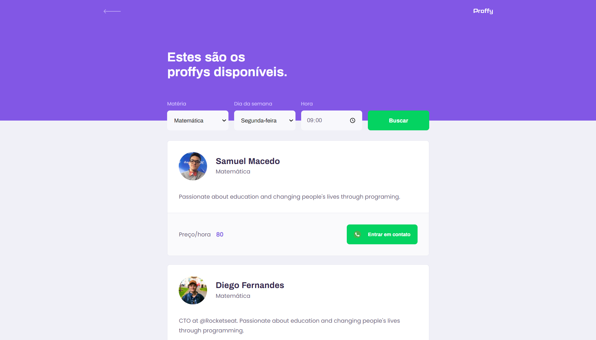

<p align="center">
    
</p>

> Projeto feito para conectar professores e estudantes, feito na NextLevel Week #2 @Rocketseat

# Screenshots

<div style="display: flex; flex-direction: 'row'; align-items: 'center';">
  
  
</div>

<div style="display: flex; flex-direction: 'row';">
  
  
  
  
</div>

# Índice

- [Tecnologias](#tecnologias)
- [Funcionalidades](#funcionalidades)
- [Execução](#execução)

## Tecnologias
Esse projeto foi feito utilizando as seguintes tecnologias:
* [Typescript](https://www.typescriptlang.org/)         
* [React](https://reactjs.org/)         
* [Expo](https://expo.io/)          
* [Express](https://expressjs.com/) 

## Funcionalidades
* Site para cadastro de estudante e professores.
* App para conectar estudantes e professores.

## Execução

### -Repositório
```bash
  # Clone o repositorio https://github.com/usamu11/nlw2-Proffy.git
  $ git clone 
```

### -API
```bash
  # Vá para a pasta do servidor
  $ cd Proffy/server
  
  # Instale as depedencias
  $ yarn install
  
  # Rode a aplicação
  $ yarn start
```

Acesse a API: http://localhost:3333/
### -Projeto Web
```bash

  # Vá para a pasta web
  $ cd Proffy/web

  # Instale as depedencias
  $ yarn install

  # Rode a aplicação
  $ yarn start
  
```
Acesse: http://localhost:3000/ para ver o resultado.
### -Projeto Mobile

Para rodar o projeto mobile você precisa de um celular com o [expo](https://play.google.com/store/apps/details?id=host.exp.exponent) instalado ou um emulador android/ios.

```bash
  # Vá para a pasta mobile
  $ cd Proffy/mobile

  # Instale as depedencias
  $ yarn install

  # Rode a aplicação
  $ yarn start

```
Depois leia o QRCode com o app do [expo](https://play.google.com/store/apps/details?id=host.exp.exponent) ou rode em um emulador.
